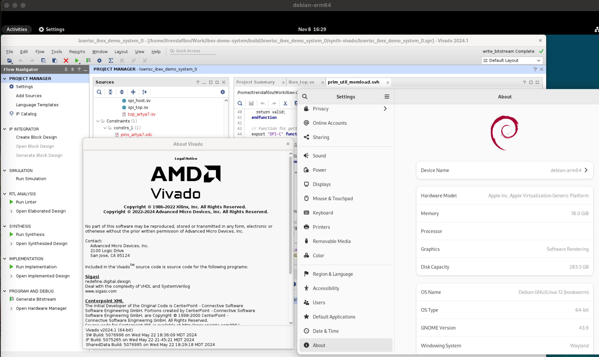
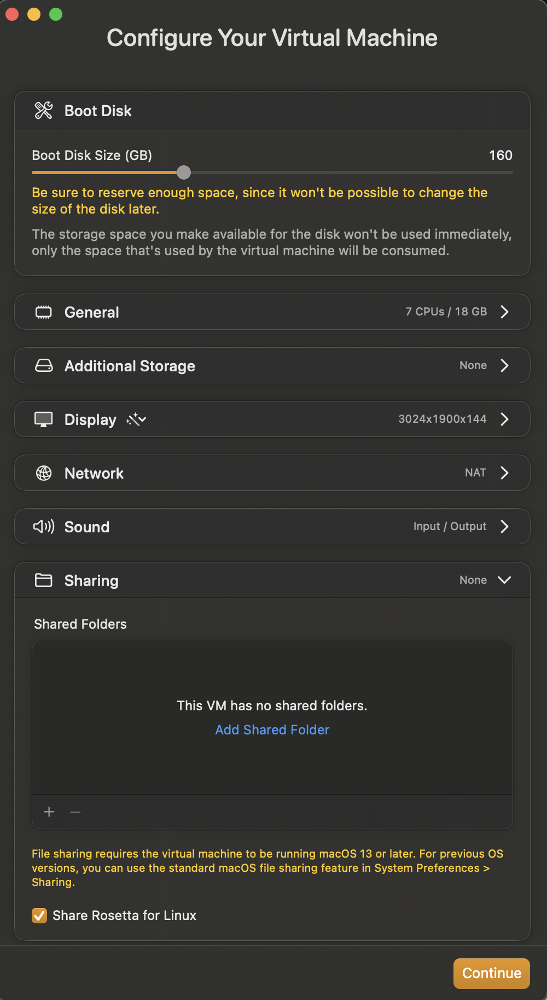

# Xilinx Vivado on Mac M3 Tutorial

This repository demonstrates how to start AMD Xilinx Vivado on Mac M3 using VZ and Rosetta. I've used Debian, which is not in supported distro list. This is only a demonstration, not a production code.



# List of Tools used

- VirtualBuddy to ease setup of Apple VZ stack [https://github.com/insidegui/VirtualBuddy]
- Debian *arm64* image for native booting on M3
- Rosetta for Linux (https://developer.apple.com/documentation/virtualization/running_intel_binaries_in_linux_vms_with_rosetta)
- Debian Multiarch (https://wiki.debian.org/Multiarch/HOWTO)

# Concept

I will use x86-64 instead of amd64 to ease text reading, because amd64 and arm64 are very look-alike. 

To run x86-64 application on arm64 we need two things:
1. CPU instruction translation - this is done by the Apple provided Virtualization Layer (VZ) and low-level CPU instruction converter (Rosetta2) to achieve good performance. 
2. x86-64 libraries, which will be provided by apt tool with appending ":amd64" to standard "apt install" commands, which installs an x86-64 library.

**NB: Try to use this for lib\* packages only**

# Step 1. Create a new Linux VM using VirtualBuddy

Install virtual buddy and create a new VM. For details check on the link under [List of Tools used](#list-of-tools-used) above.

Follow the wizard, there are only two important non-default values:
1. Use at least 120 GB drive so you will be able to install Vivado later without additional work.
2. Under Sharing, check "Share Rosetta for Linux"



# Step 2. Setup Debian

Use standard Debian installation procedure.

After complete, you need to add Rosetta support with following commands. For details check on the link under [List of Tools used](#list-of-tools-used) above.

```bash
sudo apt install binfmt-support
sudo dpkg --add-architecture amd64
sudo apt update

mkdir /mnt/rosetta
echo "Rosetta		/mnt/rosetta	virtiofs	ro	0	0" >> /etc/fstab
sudo echo ":rosetta:M::\x7fELF\x02\x01\x01\x00\x00\x00\x00\x00\x00\x00\x00\x00\x02\x00\x3e\x00:\xff\xff\xff\xff\xff\xfe\xfe\x00\xff\xff\xff\xff\xff\xff\xff\xff\xfe\xff\xff\xff:/mnt/rosetta/rosetta:F" > /etc/binfmt.d/rosetta.conf
mount /mnt/rosetta
systemctl restart systemd-binfmt.service

# Validate it works
cat /proc/sys/fs/binfmt_misc/rosetta
```

You should probably do an `apt upgrade` at this stage.

# Step 3. Install x86-64 libraries required

Install the following packages. The list is not optimized and may contain libraries that are not necessary required, but because this is meant to demonstrate the process I include all of them.

```bash
sudo apt install binutils-common:amd64 gcc-12-base:amd64 libamd2:amd64 libatk-bridge2.0-0:amd64 libatk1.0-0:amd64 libatspi2.0-0:amd64 libavahi-client3:amd64 libavahi-common-data:amd64 libavahi-common3:amd64 libblkid1:amd64 libboost-filesystem1.74.0:amd64 libbrotli1:amd64 libbsd0:amd64 libbtf1:amd64 libbz2-1.0:amd64 libc6:amd64 libcairo-gobject2:amd64 libcairo2:amd64 libcap2:amd64 libcolamd2:amd64 libcolord2:amd64 libcom-err2:amd64 libcrypt-dev:amd64 libcrypt1:amd64 libcups2:amd64 libdatrie1:amd64 libdbus-1-3:amd64 libdeflate0:amd64 libdouble-conversion3:amd64 libdrm-amdgpu1:amd64 libdrm-intel1:amd64 libdrm-nouveau2:amd64 libdrm-radeon1:amd64 libdrm2:amd64 libedit2:amd64 libegl-mesa0:amd64 libegl1:amd64 libelf1:amd64 libepoxy0:amd64 libevdev2:amd64 libexpat1:amd64 libffi8:amd64 libfontconfig1:amd64 libfreetype6:amd64 libfribidi0:amd64 libgbm1:amd64 libgcc-s1:amd64 libgcrypt20:amd64 libgdk-pixbuf-2.0-0:amd64 libgl1:amd64 libgl1-mesa-dri:amd64 libglapi-mesa:amd64 libglib2.0-0:amd64 libglvnd0:amd64 libglx-mesa0:amd64 libglx0:amd64 libgmp10:amd64 libgnutls30:amd64 libgomp1:amd64 libgpg-error0:amd64 libgraphite2-3:amd64 libgssapi-krb5-2:amd64 libgtk-3-0:amd64 libgudev-1.0-0:amd64 libharfbuzz0b:amd64 libhogweed6:amd64 libhwloc-plugins:amd64 libhwloc15:amd64 libice6:amd64 libicu72:amd64 libidn2-0:amd64 libinput10:amd64 libjbig0:amd64 libjpeg62-turbo:amd64 libk5crypto3:amd64 libkeyutils1:amd64 libklu1:amd64 libkrb5-3:amd64 libkrb5support0:amd64 liblcms2-2:amd64 liblerc4:amd64 libllvm15:amd64 liblz4-1:amd64 liblzma5:amd64 libmd0:amd64 libmd4c0:amd64 libmount1:amd64 libmtdev1:amd64 libnettle8:amd64 libopengl0:amd64 libp11-kit0:amd64 libpango-1.0-0:amd64 libpangocairo-1.0-0:amd64 libpangoft2-1.0-0:amd64 libpciaccess0:amd64 libpcre2-16-0:amd64 libpcre2-8-0:amd64 libpixman-1-0:amd64 libpng16-16:amd64 libqt5core5a:amd64 libqt5dbus5:amd64 libqt5gui5:amd64 libqt5network5:amd64 libqt5qml5:amd64 libqt5qmlmodels5:amd64 libqt5quick5:amd64 libqt5svg5:amd64 libqt5waylandclient5:amd64 libqt5waylandcompositor5:amd64 libqt5widgets5:amd64 librsvg2-2:amd64 librsvg2-common:amd64 libselinux1:amd64 libsensors5:amd64 libsm6:amd64 libssl3:amd64 libstdc++6:amd64 libsuitesparseconfig5:amd64 libsystemd0:amd64 libtasn1-6:amd64 libtbb12:amd64 libtbbbind-2-5:amd64 libtbbmalloc2:amd64 libthai0:amd64 libtiff6:amd64 libtinfo5:amd64 libtinfo6:amd64 libudev1:amd64 libunistring2:amd64 libuuid1:amd64 libwacom9:amd64 libwayland-client0:amd64 libwayland-cursor0:amd64 libwayland-egl1:amd64 libwayland-server0:amd64 libwebp7:amd64 libx11-6:amd64 libx11-xcb1:amd64 libxau6:amd64 libxcb-dri2-0:amd64 libxcb-dri3-0:amd64 libxcb-glx0:amd64 libxcb-icccm4:amd64 libxcb-image0:amd64 libxcb-keysyms1:amd64 libxcb-present0:amd64 libxcb-randr0:amd64 libxcb-render-util0:amd64 libxcb-render0:amd64 libxcb-shape0:amd64 libxcb-shm0:amd64 libxcb-sync1:amd64 libxcb-util1:amd64 libxcb-xfixes0:amd64 libxcb-xinerama0:amd64 libxcb-xinput0:amd64 libxcb-xkb1:amd64 libxcb1:amd64 libxcomposite1:amd64 libxcursor1:amd64 libxdamage1:amd64 libxdmcp6:amd64 libxext6:amd64 libxfixes3:amd64 libxi6:amd64 libxinerama1:amd64 libxkbcommon-x11-0:amd64 libxkbcommon0:amd64 libxml2:amd64 libxnvctrl0:amd64 libxrandr2:amd64 libxrender1:amd64 libxshmfence1:amd64 libxt6:amd64 libxtst6:amd64 libxxf86vm1:amd64 libz3-4:amd64 libzstd1:amd64 ocl-icd-libopencl1:amd64 qt5-gtk-platformtheme:amd64 qtwayland5:amd64 vacask:amd64 zlib1g:amd64
```
# Step 4. Install AMD Xilinx Vivado

First you need to unpack the installer with:

```bash
./FPGAs_AdaptiveSoCs_Unified_2024.1_0522_2023_Lin64.bin --noexec --keep --target xilinx-install
```

Apply the following change to xsetup, that disables architecture check:

```diff
--- xilinx-install/xsetup
+++ xilinx-install/xsetup
@@ -29,15 +29,15 @@
 
 # ERROR out if this installation is running on 32 bit OS 
 # and does not support 32 bit installation 
-if [ "$(uname -m)" != "x86_64" ]; then
-    # check that the 32 bit library directory exist or not
-    lnx32LibDir="${workingDir}/lib/lnx32.o"
-    if [ ! -d $lnx32LibDir ]; then
-   	   # terminate with an ERROR
-       echo "ERROR: This installation is not supported on 32 bit platforms."
-       exit 1;
-    fi  
-fi
+#if [ "$(uname -m)" != "x86_64" ]; then
+#    # check that the 32 bit library directory exist or not
+#    lnx32LibDir="${workingDir}/lib/lnx32.o"
+#    if [ ! -d $lnx32LibDir ]; then
+#   	   # terminate with an ERROR
+#       echo "ERROR: This installation is not supported on 32 bit platforms."
+#       exit 1;
+#    fi  
+#fi
 
 # GUI Setup
 ARGS=${ARGS}\ --add-opens=java.base/java.nio=ALL-UNNAMED\ --add-opens=java.desktop/sun.swing=ALL-UNNAMED\ --add-opens=java.desktop/javax.swing=ALL-UNNAMED\ --add-opens=java.desktop/javax.swing.tree=ALL-UNNAMED\ --add-opens=java.desktop/sun.awt.X11=ALL-UNNAMED
```

Start the installer using `./xilinx-install/xsetup` and install using the wizard. I've used `/opt/Xilinx`. It should work until the very final post-installation tasks.

I've extracted the error commands from the log under `~/.Xilinx/xinstall/*.log`.

You first need to make another patch for architecture check in loader script, apply this patch:

```diff
--- /opt/Xilinx/Vivado/2024.1/bin/loader
+++ /opt/Xilinx/Vivado/2024.1/bin/loader
@@ -69,8 +69,8 @@
   x86_64)
     ;;
   *)
-    echo 1>&2 "Unsupported architecture: `uname -m`"
-    exit 1
+    #echo 1>&2 "Unsupported architecture: `uname -m`"
+    #exit 1
     ;;
 esac
 

```

Then manually perform the tasks that failed earlier. Those commands I've found in my logs:

```bash
/opt/Xilinx/Vivado/2024.1/bin/vivado -nolog -nojournal -mode batch -source /opt/Xilinx/Vivado/2024.1/scripts/sysgen/tcl/xlpartinfo.tcl -tclargs /opt/Xilinx/Vivado/2024.1/data/parts/installed_devices.txt

/opt/Xilinx/Vivado/2024.1/bin/vivado -nolog -nojournal -mode batch -source /opt/Xilinx/Model_Composer/2024.1/data/xmcGenBoardParts.tcl -tclargs /opt/Xilinx/Model_Composer/2024.1/../../Vivado/2024.1, librdi_dsp_tcltasks.so /opt/Xilinx/Model_Composer/2024.1/data

/opt/Xilinx/Model_Composer/2024.1/bin/model_composer -postinstall
```

# Step 5. Test

It worked for me at this point. I've used this [RISC-V core](https://github.com/lowRISC/ibex-demo-system) to test mine.
